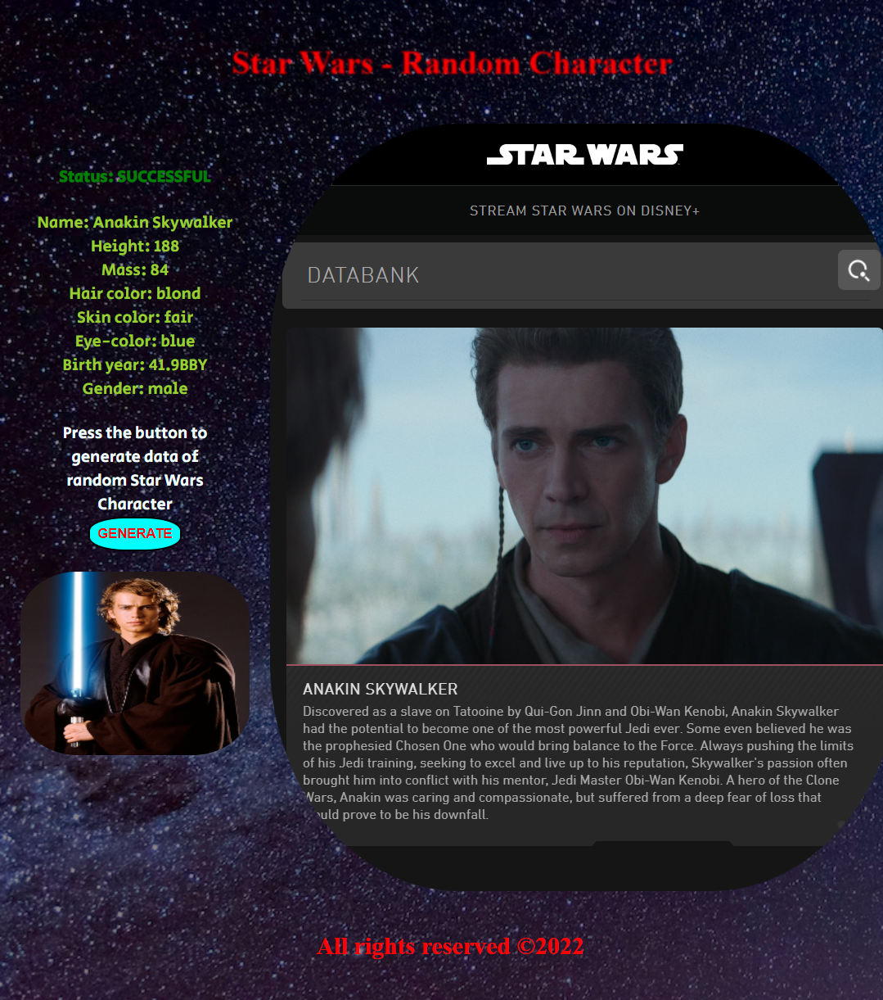

# Radnom_Star_Wars_Character Webpage
Built with JavaScript, HTML and CSS. It randomly selects a Star Wars character, displays some of their information, cross-reference the name of this character with the starwars/databank website and shows the result. 
After pressing the button GENERATE, random character data is fetched from an API called swapi.dev/api and depicted accordingly on the webpage. A status on the top of the page indicates if the process was successful or failed.
Pictures of the characters are fetched with help of API https://akabab.github.io/starwars-api/ 

**Examples view:** 

***The home page.*** 
 
